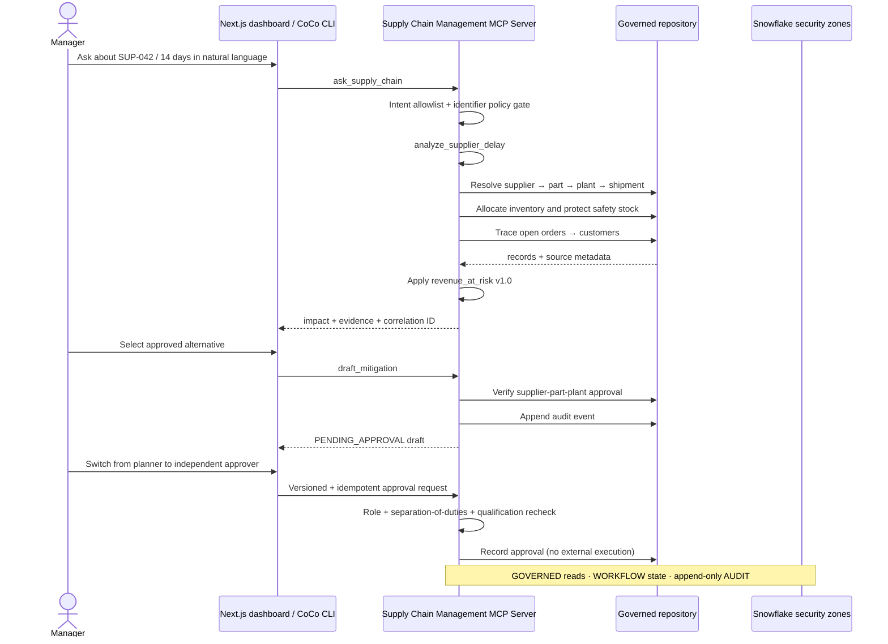

# Architecture

## System boundary

`Supply Chain Management MCP Server` is the only backend deployable. Its internal modules coordinate the complete workflow without a separate orchestration platform.

## Internal modules

- `service.analyze_supplier_delay`: workflow coordinator and supplier-risk entry point
- `service.ask_supply_chain`: allowlisted natural-language router over deterministic tools
- `service.get_inventory_risk`: safety-stock-aware inventory projection
- `service.trace_order_impact`: customer/order impact and governed revenue calculation
- `service.list_approved_alternatives`: qualification gate and deterministic ranking
- `service.draft_mitigation`: draft-only action boundary
- `service.approve_mitigation`: records an authorized decision; does not execute externally
- `FixtureRepository`: deterministic local source and in-memory append-only audit/action ledger
- `SnowflakeRepository`: named-connection adapter for governed reads, durable mitigation actions, append-only audit events, and decision idempotency
- `mcp_server`: typed MCP surface
- `main`: dashboard REST adapter

## Trust boundaries

1. **Evidence boundary:** analytics may use only governed records. Missing keys produce `INSUFFICIENT_EVIDENCE`.
2. **Qualification boundary:** mitigation options must match an approved supplier-part-plant record.
3. **Human boundary:** a planner may draft, but only an allowlisted approver role can decide; the owner cannot self-approve.
4. **Execution boundary:** approval is recorded; ERP/PO execution is intentionally outside this MVP.
5. **Audit boundary:** investigation, conversation, draft, and approval events are separately attributable through a correlation ID.
6. **Concurrency boundary:** action versions plus idempotency keys prevent stale or duplicate decisions.
7. **Failure boundary:** the frontend preserves the last verified state and never simulates success when the API fails.

## Repository modes

The service selects its repository at startup:

- `SUPPLYCHAIN_DATA_MODE=fixture` (default) uses deterministic local data for offline development and judging fallback.
- `SUPPLYCHAIN_DATA_MODE=snowflake` uses `SnowflakeRepository` with the profile named by `SNOWFLAKE_CONNECTION_NAME`.

The Snowflake adapter reads only governed entity views, records query IDs, and persists draft/decision/idempotency state in `WORKFLOW` plus evidence in the append-only `AUDIT` zone. `SOURCE` is private, `GOVERNED` is read-only to the application, and the legacy `CORE` compatibility zone is denied to application roles. The adapter disables inherited secondary roles on every application connection, so a developer who also holds `ACCOUNTADMIN` cannot silently widen the runtime boundary. It uses a short controlled snapshot TTL for fast repeated graph traversal without requiring a process restart to see changes. Action and audit writes use an explicit non-autocommit transaction. A decision update is conditional on the previous action version and pending status, so concurrent stale approvals fail closed. CoCo CLI and the Python connector share the same password-free profile in `~/.snowflake/connections.toml`; credentials never enter the repository.

CoCo has two explicit paths. Its registered MCP server drives the deterministic workflow tools. Its credit-backed Cortex Analyst command targets the native semantic view, while a local harness permits only the semantic object or its declared `GOVERNED.ORDER_RISK` logical table before executing generated SQL. The deployed secure Cortex Agent wraps the same Analyst resource with no mutation or external-execution tool; the current trial account blocks native Agent invocation, so it is a ready integration rather than a claimed successful runtime path.
